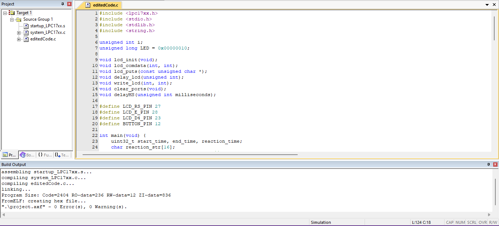

# Reaction Time Tester
<b>Objective:</b> The objective of this mini-project is to develop a reaction time testing game using an ARM Cortex M microcontroller. The game measures the player's reaction time by measuring the time it takes to press a button after an LED turns on.   
<b>Brief Description:</b> The gameplay involves an LED turning on for a random amount of time between 1 and 5 seconds. Once the LED turns off, the player must press the button as quickly as possible. The microcontroller measures the time between when the LED turns off and when the button is pressed, and the player's reaction time is displayed on an LCD display. The hardware required for this project includes an LED, an LCD display, a button/switch, jumper wires, and an ARM Cortex M microcontroller (NXP LPC1768). This mini-project aims to provide an entertaining way to test the player's reaction time while also demonstrating the use of microcontrollers in gaming applications.  
<b>Hardware Required:</b>
<li>An LED
<li>LCD display
<li>A button/switch
<li>Jumper wires
<li>ARM Cortex M microcontroller (NXP LPC1768)  
<b>Gameplay:</b>
<li>The LED turns on for a random amount of time between 1 and 5 seconds.
<li>When the LED turns off, the player must press the button as quickly as possible.
<li>The microcontroller measures the time between when the LED turns off and when the button is pressed.
<li>The player's reaction time is displayed on an LCD display.  

<b>How to run the program</b><ol>
<li>Open Keil µVision4 and create a new project: Click on Project → New µVision Project. Select the directory where you want to save your project and give it a name.
<li>Configure the project: Click on Project → Options for Target. Select the Device tab and choose the device that you are using (in this case, NXP LPC1768). Configure other settings in the Configuration WIzard of system_LPC17xx.h
<li>Add the source files to the project: Right-click on the Source Group folder in the Project window and select Add Existing Files to Group. Browse to the directory where your source code is saved and select the main.c file. Click Add.
<li>Build the project: Click on Project → Build Target. If there are no errors in the code, the project will build successfully and you will see a message saying "Build target 'Target 1' completed." 
<li>Configure FlashMagic: Open FlashMagic and select the correct serial port and baud rate for your microcontroller board. In the Options menu, make sure that the correct device (NXP LPC1768) is selected.
<li>Connect the board to the computer: Connect your microcontroller board to the computer using a USB cable.
<li>Load the program: In FlashMagic, select the HEX file that was generated by Keil µVision4. Click on the Start button to begin downloading the program to the board.
</ol> 
<b>Keil µVision4 Window</b>
  
<b>Note: </b>Required files to be included like lpc17xx.h, system_LPC17xx.c and startup_LPC17xx.s have been included in the repository for easy access.
